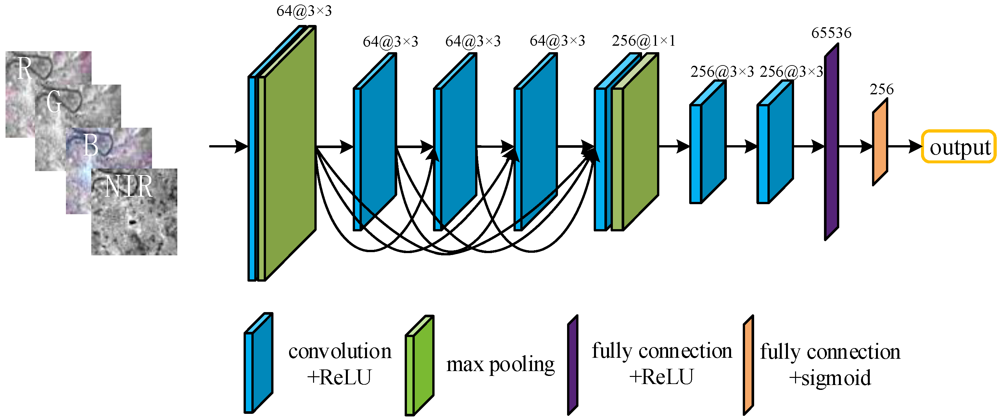

# DenseMatching.pytorch

## Introduction

This is a very simple PyTorch implementation of [Matching RGB and Infrared Remote Sensing Images with Densely-Connected Convolutional Neural Networks](https://www.mdpi.com/2072-4292/11/23/2836). You can see the original codes and datasets in [here](http://gpcv.whu.edu.cn/data/Densely_Connected_CNN.html). This network is for template matching between RGB and Infrared images.

<p align="center"></p>

### Note
This repository is incomplete because of the lack of datasets for training. I do not guarantee the usefulness of this repository. So I recommand this codes only for reference. If possible, I will add evaluation codes and the path for reaching suitable datasets. 

## Prerequisites
* PyTorch
* Numpy
* Matplotlib
* tqdm

## How to train
* Download the dataset (.npy files) in [here](http://gpcv.whu.edu.cn/data/Densely_Connected_CNN.html).
* Just put a command
```bash
python train.py
```
## ToDo
* Add evaluation codes
* Construct a full pipeline for matching RGB and Infrared images.
